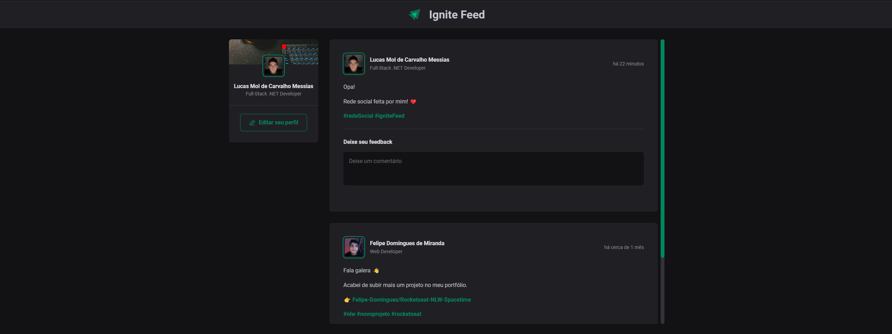

<h1 align="center">Ignite Feed</h1>

Criado na trilha React do bootcamp Ignite promovido pela Rocketseat para ensino dos fundamento do framework ReactJS.  

  <a href="#-tecnologias">Tecnologias</a>&nbsp;&nbsp;&nbsp;|&nbsp;&nbsp;&nbsp;
  <a href="#-projeto">Projeto</a>&nbsp;&nbsp;&nbsp;|&nbsp;&nbsp;&nbsp;
  <a href="#memo-licença">Licença</a>

  

 

  

## 🚀 Tecnologias

Esse projeto foi desenvolvido com as seguintes tecnologias:

- ReactJS
- TypeScript
- JavaScript
- Module CSS
- HTML
- Vite
- Git e Github
- Figma

## 💻 Projeto

O Ignite Feed é uma SPA (Single Page Application) que simula um feed de rede social e suas funções front-end básicas.

- [Acesse o projeto finalizado, online](https://ignite-feed-indol.vercel.app/)

## :memo: Licença

Esse projeto está sob a licença MIT.

---
